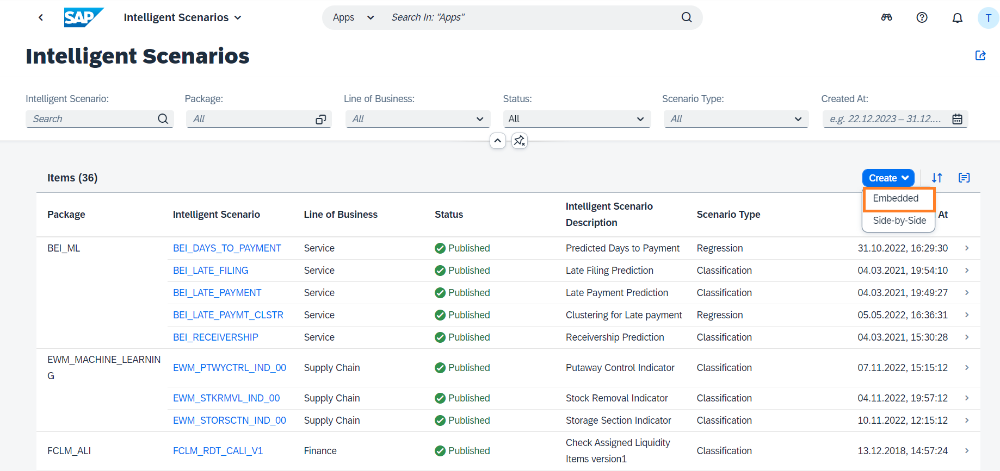

# Harnessing ISLM with SAP HANA ML 
## Scenario storyline: First Class Seats Occupied 
In this practical exercise, our focus is on utilizing the SAP HANA Machine Learning (ML) algorithm to predict the occupancy of first-class seats on flights using APL Library. 

To execute this exercise, we will leverage the Intelligent Scenario Lifecycle Management (ISLM) framework. ISLM serves as the foundation for creating and managing ML use cases seamlessly within the SAP S/4HANA stack. 

This exercise includes the following steps: 

1) **Creating a New Intelligent Scenario:** We will begin by creating a new intelligent scenario that will encompass the predictive model for first-class seat occupancy. 

2) **Operating the Intelligent Scenario:** Once the scenario is set up, we will operate it to enable the prediction process. 

3) **Visualizing Model Version Predictions:** This step involves visualizing the predictions generated by the model versions within the intelligent scenario. 

4) **Schedule Training:** This step involves scheduling training for intelligent scenario based on selected frequency. 

By the end of this exercise, participants will have gained hands-on experience in utilizing the ISLM framework and SAP HANA ML algorithm to enhance decision-making processes and improve customer experiences. 

## 1. Create Intelligent Scenario 
The Intelligent Scenarios app is used to create intelligent scenarios, review, and publish them, and to make them available in the Intelligent Scenario Management app. 

In this step, you’ll create a new intelligent scenario to predict the airplane seats occupation in the first class of a flight using SAP HANA ML algorithm. 

 

For this use case we will use regression model with Gradient Boosting algorithm. 

SAP HANA APL lets you build and apply different types of predictive models, such as classification, regression, and time series forecasting models.  

Gradient Boosting regression model type provides a more accurate modeling result than the legacy regression model.

1. Open the Fiori Launchpad. Check the URL, Input the username and password provided in the cheat sheet. Click on My Home section and choose the Intelligent Scenario app.

2. Click the Create button and chooseàEmbedded. In Embedded approach, a business application, for example SAP S/4HANA runs in the same stack as its machine learning provider SAP HANA machine learning with the analytics libraries SAP HANA Automated Predictive Library (APL) or SAP HANA Predictive Analysis Library (PAL).

3. Click on Do Not Show Again and Close in the Onboarding Dialog.

4. Provide the required information in the screen: 
    1) **Intelligent Scenario Name:** Enter a unique name starting with Z, such as `Z_SEATOCC_FTCLAS_###` ### is your attendee id. 
    2) **Intelligent Scenario Description:** Enter a description for the Intelligent Scenario. Intelligent Scenario Type, Algorithm and Machine Learning Library is automatically populated.

    
5. Click on the **Add Model** button.

6. The APL Regression Model screen will pop up. Provide information as mentioned below: 
    1) **Name:** Enter a model name starting with Z. 
    2) **Description:** Enter a description.
    
    

    3) Enter a CDS view to be used as **Training Dataset**: `ZISLM_SFLIGHT_TRAIN_CDS`.  Training Dataset to be used for training the model. 
    4) Enter a CDS view to be used as **Apply Dataset**: `ZISLM_SFLIGHT_APPLY_CDS` (Note that apply dataset is different from training dataset).  Apply dataset is Dataset used for prediction.

    

    5) Select your target variable. **Target**: `SEATSOCC_F`.  Target variable is field whose value you want to predict. 
    6) **Max Reason Code:** `1` Number of reason codes you want to generate. Reason codes are variables whose values have the most influence in a score-based decision (typically a risk score).  The variables for which the contribution is the most differential are selected as the most important reason codes.  Apply output configuration has the selected metrics that are added in the intelligent scenario output and used for prediction. 
    7) Click on the **Add** button.
    
    

7. The scenario is now created in **Draft** Status. View the Input and Output fields to train the model in the **Input and 
   Outputs Tabs** respectively. 

   Input Tab displays the key, input, and target fields. 
   The Input variable is considered for modelling. The Key variable is a key field of the dataset and is also considered 
   for modelling. The Target variable is the variable whose values are to be modelled and predicted by other variables.
    
   
   Output tab displays the Key, Target, and Prediction fields. 
The Prediction variable includes the calculation result.

8. Scenario is now ready to be published. Click on **Publish** button. You will receive a message that Intelligent Scenario is published.

9. Search the Intelligent Scenario created by you by entering the **Intelligent Scenario name and Status = Published**.

10. Navigate to the details page by clicking the `>` icon. 

11. Click on **Apply Setting** Tab and copy the CDS View name. CDS views are generated for the intelligent scenario to allow easy access to the predictions  
### Well done, you just created your first embedded Intelligent Scenario.
 

## 2. Operating the Intelligent Scenario
Once the Intelligent Scenario is published, the Intelligent Scenario Management app helps you to train, monitor the model quality and activate the model for productive usage.

In this section, you will use the Intelligent Scenario Management app to perform ML operations. 

1. Open the Fiori Launchpad. Check the URL, Input the username and password provided in the cheat sheet. Click on **My Home** section and choose the Intelligent Scenario Management app.

2. Search the **First-Class Seats Occupied** scenario created by you and navigate to the details page by clicking the `>` icon.  
3. Select the Model and click on the **Train button** to trigger the training.
    
4. In the Model section, view the Dataset Record Count. Click on **Train** button.
    
5. New Model Version will be created in **Scheduled** status.
    
6. Monitor the status of the **Model Version** and check the status changes to **Training**.
    
7. Monitor the status of the Model Version and check the status changes to **Ready**.
    
8. Click on **'>'** icon to view Model Version Report.
    
9. View different tabs like **Quality Information and Debrief**. You can see attributes about data quality and what key influencers 
   are affecting the predictions.
    
   **Mean Absolute Error(MAE):** Average absolute difference between the predicted values and the actual values. The lower 
     the better.
   
   **Root Mean Square Error(RMSE):** RMSE is the square root of mean squared error. It measures the average difference 
    between values predicted by a model and the actual values. RMSE tells us how close the actual values are to 
    prediction values made by the model. The lower the better.
   
   **Mean Absolute Percentage Error(MAPE)** Average of the absolute percentage errors of the predictions. The lower the 
    better.
     Choose the back icon  to navigate back to Model Versions screen.
10. Activate the model version to return predictions. Select the Model Version and click the **Activate** button.
     

### Well done, you just Operated the Intelligent Scenario by training your first model.
 

## 3. Visualizing Model Version Predictions
In this step, you will use the ABAP Development Tools to view the model's prediction.
 You can start the ABAP Development Tools via the Windows Taskbar.
 

1. Click on `Run ABAP Development Object as ABAP Application in SAP GUI` button, or alternatively press `Alt + F8`. If you're asked for credentials, please login the username and password provided in the cheat sheet.
 

1. Type **se38** in the search dialog and clck **OK**.
    

2. Search for report **RUT_DDLS_DATA_PREVIEW** and click on Execute 
    

3. Enter the ISLM generated CDS view of created Intelligent Scenario to view predictions from trained model. This CDS View was copied in the first step during creation of the Intelligent Scenario. 
   **CDS View will have following name <INTELLIGENT_SCENARIO_NAME>_CDS01.** 
   Enter CDS View Name in Entity Name field and click on **Execute**.
    

4. You can scroll down and see the model's keys in the first four columns: **Airline Code, Flight Connection Number, Flight Date and Booking number.**  
Column **SEATSOCCF** has the actual value of the seats occupied. 
Column **GB_SCORE_SEATSOCCF** column has the predicted value of the occupied seats.
 

 ### Well done, you just visualized your trained model predictions..!

# Schedule training 
You can schedule a training for your intelligent scenarios. Once the trainings are scheduled, model versions are created automatically based on the selected frequency and preselected filters.

1. Open the Fiori Launchpad. Check the URL, Input the username and password provided in the cheat sheet. 

    Click on **My Home** section and choose the **Intelligent Scenario Management** app.
    
2. Search the **First-Class Seats Occupied** scenario created by you and navigate to the details page by clicking the **>** 
   icon.
    
3. Click on **Create Schedule**.
    
4. View the information displayed in the screen. Click on **Model Version** value help.
    
5. Select the reference Model Version.
    
6. Click on **Go to Step 2**.
    
7. Review Scheduling Options automatically proposed by the system.  
   Enter the Start as **2 minutes later** than the system proposed time.  
   Schedule for **1 Occurrence(s)** and click on **Go to Step 3**.
    
8. Review the section Intelligent Scenarios Details and Schedule Details. 
   Click on **Create Schedule** 
    
9. Click on **Schedule Planned Task** tab to view the planned task created as a result of scheduling of training.
     
10. Click on **>** icon.
     
11. Review **scheduling Options** and **Scheduling Runs** tab.
     
12. Click the highlighted icon to view the created Model Version. **This step will take time** as logs are opened in another App.
     
13. View the created **Model Version ID**.
     
14. Choose the back icon  to navigate back Scheduled Planned Task screen.  
    Choose the back icon  to navigate back to Model screen.  

    Click on **>** icon to view the created Model Version.
     
15. View the created Model Version as outcome of Scheduling of Training.
     

### Well done, you just scheduled training.
 

## Summary
🎉 Congratulations! 🎉  
You have successfully completed the Schedule Training.  
