# Predict the plane type of an aircraft

In this exercise, we are going to predict the plane type of an aircraft using SAP BTP based ML service Data Attribute Recommendation. We will use the Intelligent Scenario Lifecycle Management (ISLM) framework to create and operate the ML use case. 

Data Attribute Recommendation uses machine learning to predict and classify data records.<br>
With Data Attribute Recommendation you can
  -	Automate and speed up data management processes
  -	Reduce errors and manual efforts in data maintenance
  -	Increase data consistency and accuracy

This exercise includes the following steps: 
1. Create and publish Intelligent Scenario.
2. Set up the connection for Intelligent Scenario to connect to BTP based ML service.
3. Use Intelligent Scenario Management app to train, view model quality, deploy and activate the model.
4. View the inference result returned by the model in an ABAP report.

## 1. Create and publish Intelligent Scenario

The Intelligent Scenarios app is used to create intelligent scenarios, review, and publish them, and to make them available in the Intelligent Scenario Management app. In this step, you’ll create a new intelligent scenario to predict the plane type using SAP BTP based ML service Data Attribute Recommendation. 

1. Create a Prediction Class which defines the behavior of the scenario.<br>

   Prediction class has methods to specify Inference type and ML Template for Data Attribute Recommendation. 
   For this use case, we will use generic template which make use of Classification algorithm.<br>
   
   Open **SAP Logon** and logon to system **S4H 100** <br>
   Open transaction **/nse24** and search for the ABAP class mentioned in User Details for your user group. 
   

2. Click on **Copy** 
   <br>

3. Provide the unique name in the Copy to field.<br>  
   Enter a unique name starting with ZCL, such as **ZCL_PLANTYPE_###**, where ### is your attendee id. 
   <br>Click on tick icon.
   <br>

4. Click on **Local Object** 
   <br>

5. Class is created in Inactive status. Click on **Display**
   <br>

6. Click on **Activate** icon
   <br>

7. Click on tick icon
   <br>

8. Ctrl+Click [here](https://44.217.183.24:44301/sap/bc/ui5_ui5/ui2/ushell/shells/abap/FioriLaunchpad.html?sap-client=100&sap-language=EN#Shell-home) to open Fiori Launchpad in a new tab.<br>
   Enter the user details as provided in sheet.

9. Click on **Analytics** section and choose the **Intelligent Scenario** app.
   <br>

10. Click the **Create** button and choose->**Side-by Side**.
   This approach is commonly known as '**side-by-side**,' where the ML provider and the business application operate in separate stacks.
   <br>

11. Provide the required information in the screen:
	1. **Intelligent Scenario Name**: Enter a unique name starting with Z, such as `Z_SFI24_PLANTYPE_###` where **###** is your attendee id.
	2. **Intelligent Scenario Description**: Enter a description for the Intelligent Scenario.
	3. **Intelligent Scenario Type** as **Data Attribute Recommendation** 
 
   <br>

   <br>

12. Select **Prediction Class** from value help 
    <br>
13. Click on **OK** in the information box
    <br>
14. Select the prediction class created by you in the previous section
    <br>
15. Click on the Add Model button. The DAR Model screen will pop up. In the General Information section, provide a Name starting with Z and Description for the model. In the section Data, provide the below details. Training Dataset (CDS views): Z_SFLIGHT_DATA.
    <br>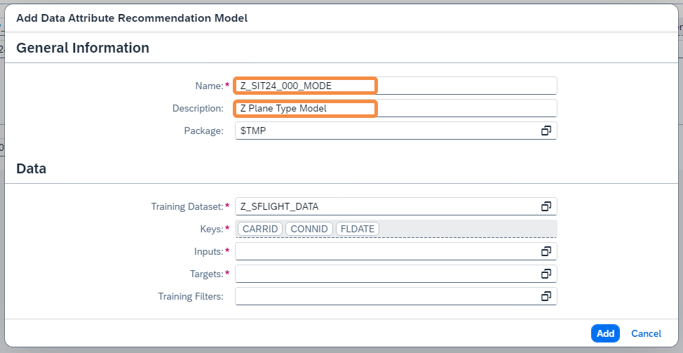
16. Click on Input value help
    <br>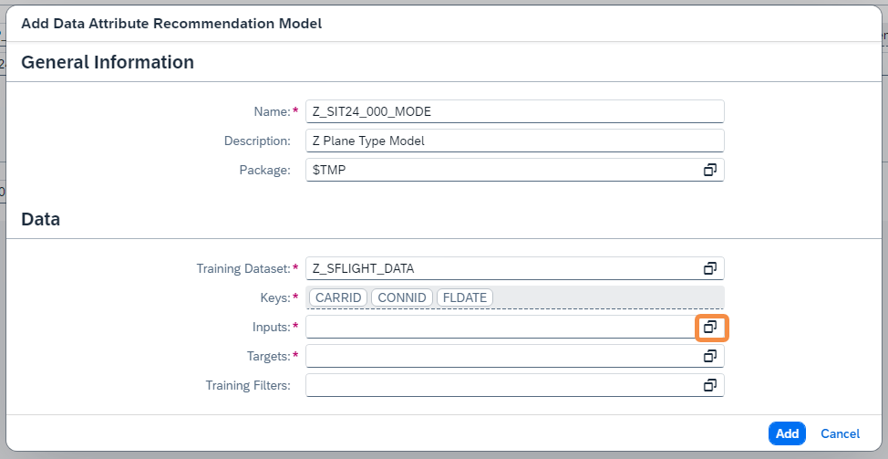
17. The Select Model Inputs will pop up. Select all the Inputs expect CARRID, CONNID, PLANETYPE. Use Select All option and uncheck the CARRID, CONNID, PLANETYPE.
    <br>
18. Select the Data Management Type as Category/Number. Then, click on Select button.
    <br>
19. Click on Target value help
    <br>
20. The Select Model Targets will pop up. Select PLANETYPE. Select the Data Management Type as CATEGORY. Click on Select button.
    <br>
21. Click on Add button.
    <br>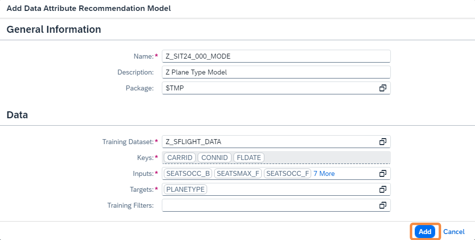
22. The scenario is now created in Draft Status. View the Input and Output fields to train the model in the Input and Outputs Tabs respectively. Also Scenario is now ready to be published. Click on **Publish** button. You will receive a message that Intelligent Scenario is published.
    <br>
23. Search the Intelligent Scenario created by you by entering the **Intelligent Scenario name** and **Status = Published**. 
    <br>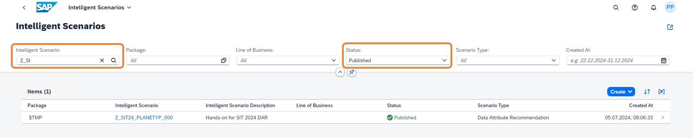

### Well done, you just created your first Side-by-side Intelligent Scenario.
<br>

## 2. Set up the connection for Intelligent Scenario to connect to BTP based ML service

Once the Intelligent Scenario is published, we need to maintain the connection for an intelligent scenario in SAP S/4 HANA with the Data Attribute Recommendation service in BTP. Speaker has provisioned the ML Service in BTP and  **service key** details are provided in step 7 to setup the connection. 

1. Open **SAP Logon** and logon to **S4H 100**<br>
   Open transaction **/nSPRO**<br>
   Click **SAP Reference IMG** 
   <br>
2. Click on **Yes** to proceed
   <br>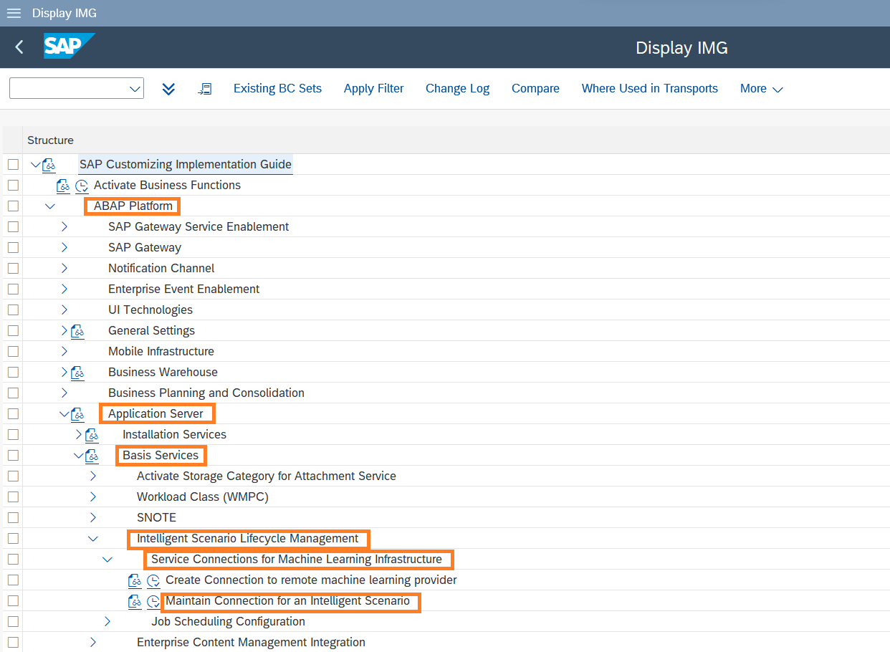
3. Navigate to **ABAP Platform >Application Server >Basis Services >Intelligent Scenario Lifecycle Management> Service Connections for Machine Learning Infrastructure > Maintain Connection for an Intelligent Scenario**.Click on **Execute**
    <br>
5. The ISLM Connection Mapping window opens. Click the **Create Connection** icon. 
   <br>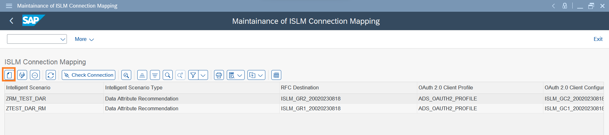
6. Input the Intelligent Scenario Name and click on **Next**
   <br>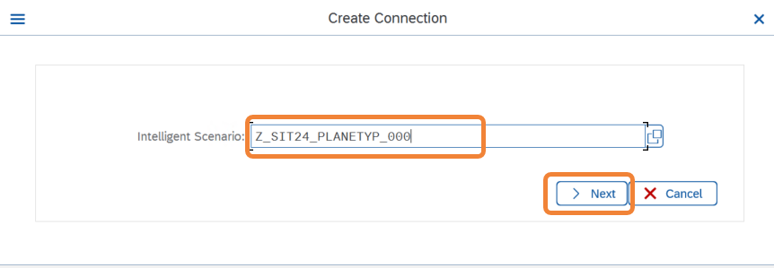
7. Enter the Service Key details. Please find the service key in a .txt file in desktop to get Service Key details.
   <br>
8. Click **Next**.
   <br>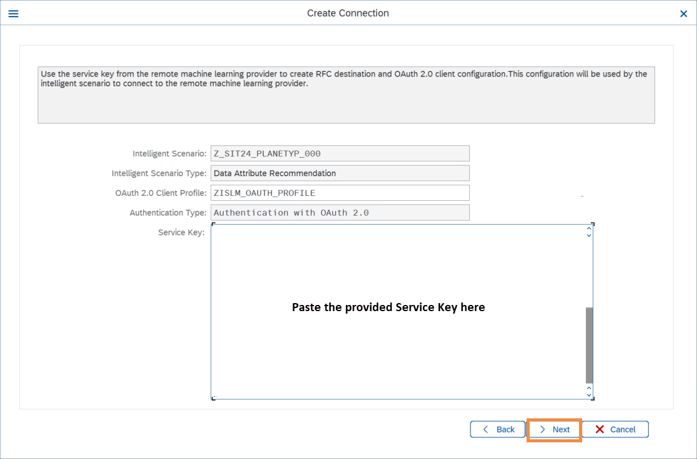
9. Perform **Connection Check** to know the health of ML provider.
    <br>
10. Check the Connection Status changes to **Ready**. Click **Save**.
    <br>
11. New entry will be added to the table.
    <br>

### Well done, you just Set up the connection for Intelligent Scenario to connect to BTP based ML service.
<br>

## 3. Use Intelligent Scenario Management app to train, view model quality, deploy and activate the model
Once the Intelligent Scenario is published, the Intelligent Scenario Management app helps you to train, monitor the model quality, deploy, and activate the model for productive usage.
In this section, you will use the Intelligent Scenario Management app to perform ML operations. 

1. Ctrl+Click [here](https://44.217.183.24:44301/sap/bc/ui5_ui5/ui2/ushell/shells/abap/FioriLaunchpad.html?sap-client=100&sap-language=EN#Shell-home) to open Fiori Launchpad in a new tab.<br>
   Enter the user details as provided in sheet. Click on **My Home** section and choose the **Intelligent Scenario 
   Management** app.
   <br>
3. Search the **Plane type** scenario created by you and navigate to the details page by clicking the **>** icon. 
    <br>
4. Select the Model and click on the **Train** button to trigger the training.
   <br>
5. Train dialog opens. Select a Version in the remote machine learning provider. Click on value help.
   <br>
6. Select the version 3.0 in the version field.
<br>
7. Enter the package size as 100 to specify the maximum number of records to be retrieved at a time from the dataset.
   <br>
8. Review the information in the train dialog. Click on Train.
   <br>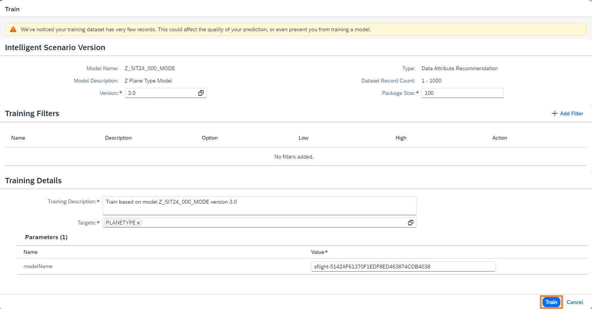
9. New Training will be created in Scheduled status.
   <br>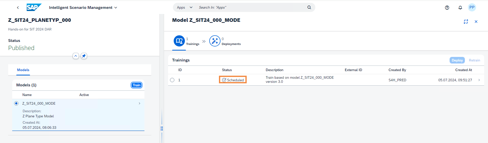
10. Monitor the status of Training and check the status changes to Uploading Data.
   <br>
11. Monitor the status of Training and check the status changes to Training.
   <br>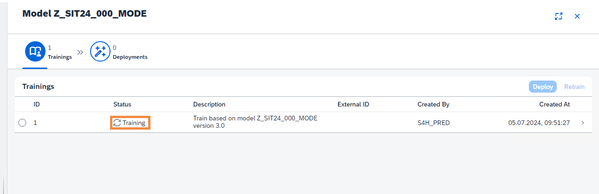
12. Monitor the status of Training and check the status changes to Completed. Note that training can take approximately 10-15 minutes to complete.
   <br>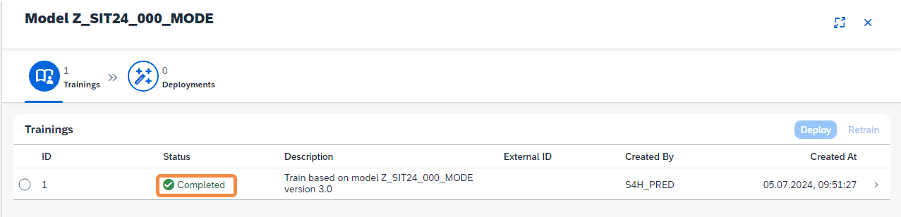
13. Click on **>** icon to view Training Report.
   <br>
14. View the information in header section. 
    Click on **Debrief** tab.
    <br>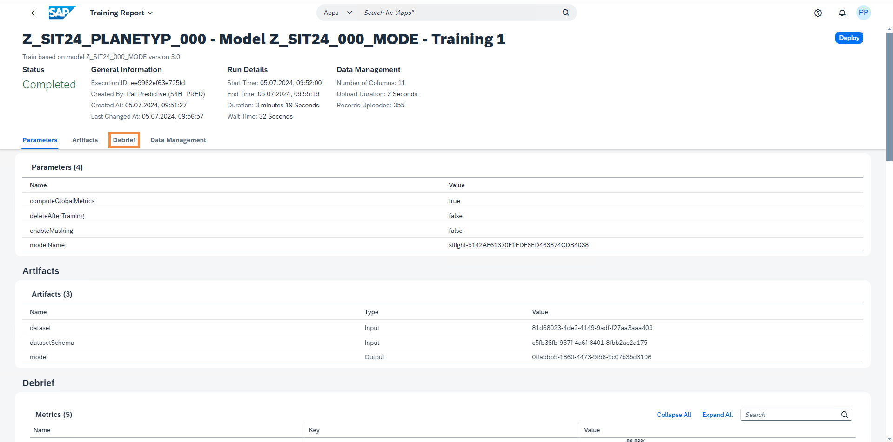
15. View Overall and target metrics in Debrief. **Accuracy, F1Score, Precision and Recall** are classificaiton metrics. The higher the better.
    <br>
16. Click on Data Management tab to view details of data packets.
    <br>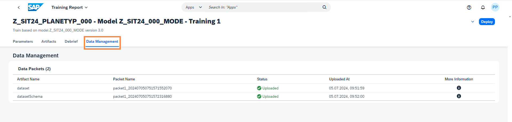
17. Choose the back icon to navigate back to Trainings screen.
    <br>
18. Click on **Deploy** Button
    <br>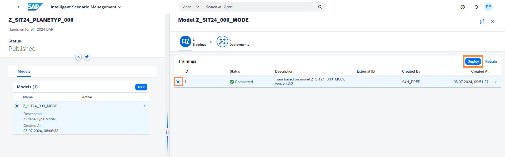
19. Click on **Deploy and Monitor** Button
    <br>
20. New Deployment will be created in Scheduled status.
    <br>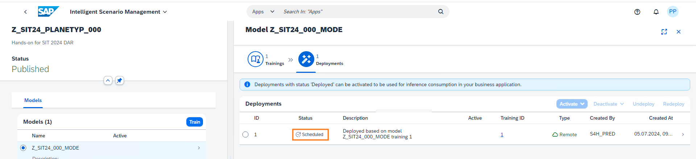
21. Monitor the status of Deployment and check the status changes to Deployment Pending.
    <br>
22. Monitor the status of Deployment and check the status changes to **Deployed**. Note that Deployments can take 
    approximately **10 minutes** to be Deployed.
    <br>
23. Activate the deployment to run inference. Select the Deployment and click on **Activate** button and choose **For All** 
    option. In the dialog Activate for All Users, choose **Activate For All**. Monitor that the Deployment has **Active for 
    all** Indicator. Then the status will changes Acive
    <br>

### Well done, you just Used Intelligent Scenario Management app to train, view model quality, deploy and activate the model
<br>
    
   
## 4. View the inference result returned by the model in an ABAP report
  In this step, you will use the ABAP GUI to view the inference result from the trained model.

   1. Logon to system **S4H** open transaction **/nSE38**
      <br>
   2. Input Report Name as
      ```
      ZR_ISLM_TEST_OPERATION_API
      ```
       and Click on **Execute** Button
      <br>
   3. In the API Definition, choose option **TRIGGER_ONLINE_INFERENCE** from drop down.
      <br>
   4. Enter the prediction class associated with your Intelligent Scenario.
      Click on **Execute**.
      <br>
      <br>
      Copy the below text which contains the Inference Request in JSON format.

      Inference Request contains the features and its value which is input for the trained model.
      
      Your trained model is now ready to predict the target **PLANETYPE**.

      **topN**-parameter which defines how many options will be predicted.
      
      To predict this target, inputs to model has to be provided.

      Inputs would be **FLDATE, PRICE, SEATSMAX, SEATSOCC, SEATSMAXB, SEATSMAXF, SEATSOCCB, 
      SEATSOCCF, PAYMENTSUM, CURRENCY**.
      # Inference Request in JSON
```json
{
    "topN": 2,
    "objects": [
        {
            "objectId": "optional-identifier-5",
            "features": [
                {
                    "name": "FLDATE",
                    "value": ""
                },
                {
                    "name": "PRICE",
                    "value": "422.94"
                },
                {
                    "name": "SEATSMAX",
                    "value": "385"
                },
                {
                    "name": "SEATSOCC",
                    "value": "374"
                },
                {
                    "name": "SEATSMAXB",
                    "value": "31"
                },
                {
                    "name": "SEATSMAXF",
                    "value": "21"
                },
                {
                    "name": "SEATSOCCB",
                    "value": "29"
                },
                {
                    "name": "SEATSOCCF",
                    "value": "21"
                },
                {
                    "name": "PAYMENTSUM",
                    "value": ""
                },
                {
                    "name": "CURRENCY",
                    "value": ""
                }
            ]
        }
    ]
}
```
5. Paste the copied text in the **text editor**. Click on **tick** icon.
   <br>
 
6. View the response from the trained model.

   In the response, you find the values that the model predicted. This includes the value that is predicted and the 
   probability. The probability describes how certain the model is about its prediction. **If the probability is close to 1, 
   the model is very certain**.
   
   Model predicts the PLANETYPE with two possible values(as defined in Inference request **"topN": 2** )
	| Predicted Value | Probability    | 
	| :---:   | :---: | 
	| 747-400 | 0.9646   |
	| 767-200 | 0.010   | 

   
   <br>

### Well done, you just Viewed the inference result returned by the model in an ABAP report.
<br>

## Summary
🎉 Congratulations! 🎉 <br>
You have successfully completed the Exercise!

