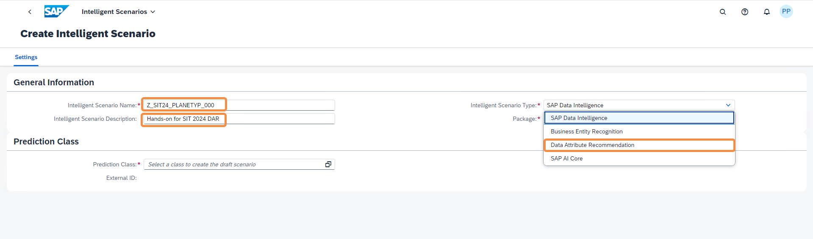
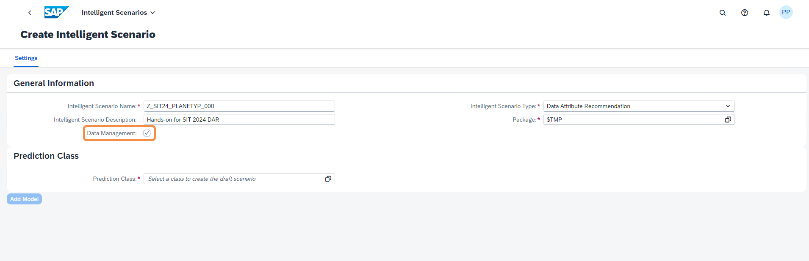
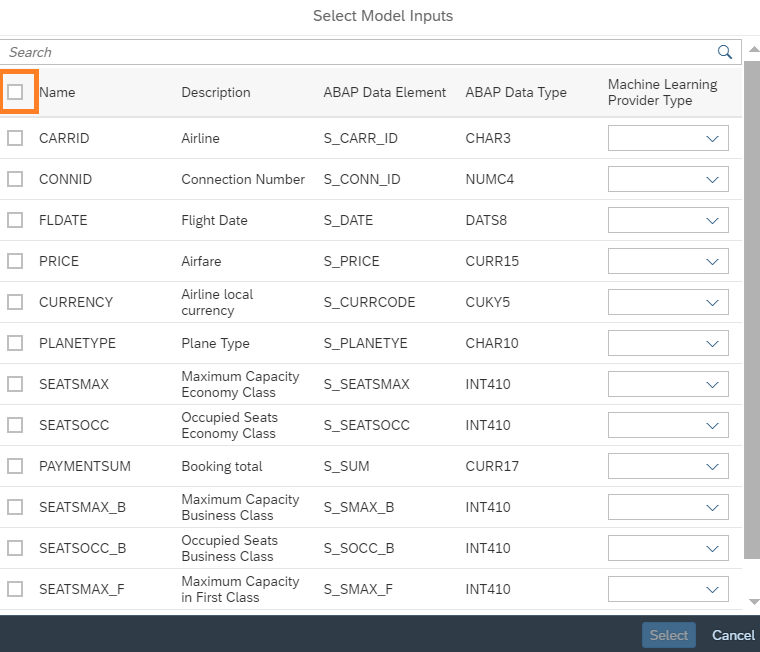
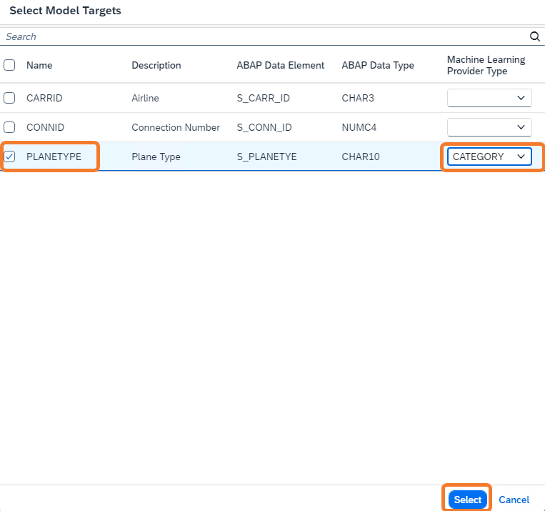
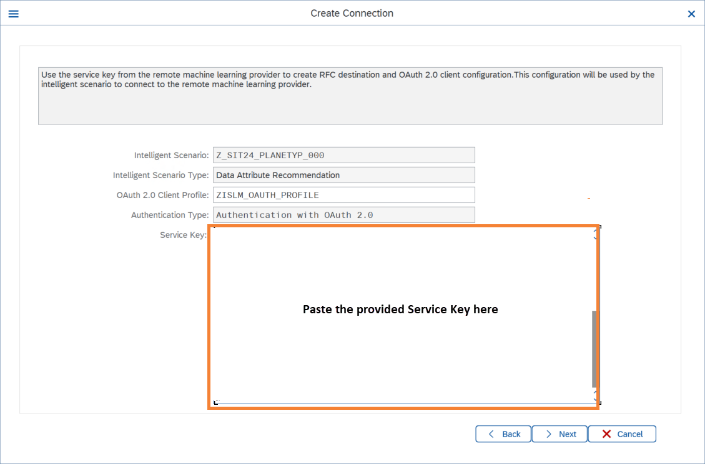
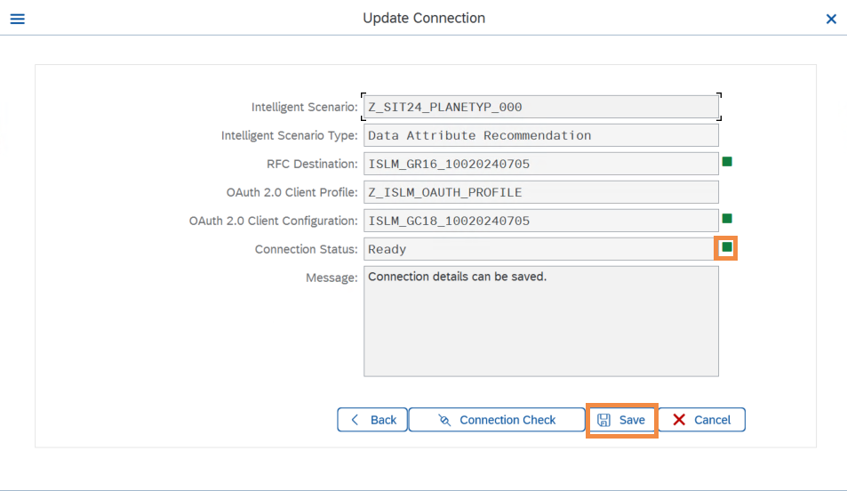
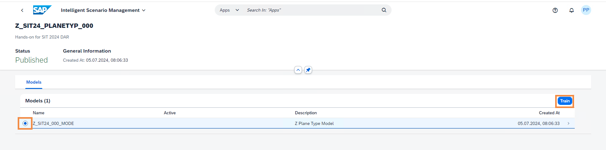
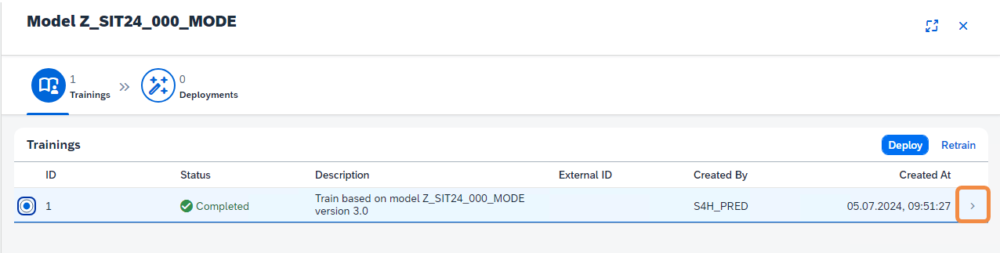
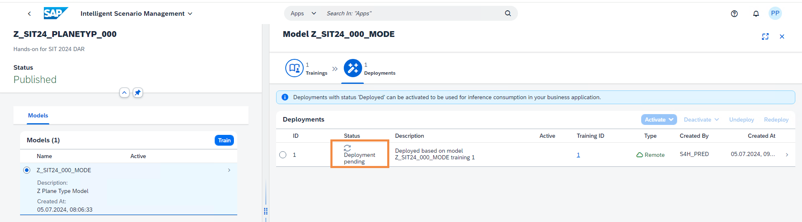

# Creating Custom AI Use Cases in SAP S/4HANA
## Context 

In the rapidly evolving landscape of AI and machine learning, Intelligent Scenario Lifecycle Management (ISLM) has emerged as a critical framework that bridges the gap between data science endeavors and practical application development. ISLM plays a pivotal role in streamlining and optimizing the adoption of AI solutions, particularly within the SAP S/4HANA environment. 

ISLM standardizes the integration and consumption of intelligent scenarios within SAP S/4HANA for both embedded as well as side-by-side scenarios. 

ISLM can be leveraged to perform lifecycle operations, including (scheduled) (re-)training and deployment as well as activation of the model that should be consumed by the business application, directly within SAP S/4HANA. MLOps in ISLM is supported in the context of ML use case (Intelligent Scenario). 
<br>

## ISLM brief introduction
ISLM framework stacked into SAP S/4HANA, is the right tool for application developers for SAP S/4HANA. ISLM standardizes the integration and consumption of intelligent scenarios within SAP S/4HANA for both embedded as well as side-by-side scenarios. Thus, application developers are required to use ISLM to create, register, and publish new scenarios and to implement the consumption of that scenario within the business application.  

ISLM can be leveraged to perform lifecycle operations, including (scheduled) (re-)training and deployment as well as activation of the model that should be consumed by the business application, directly within SAP S/4HANA. ML ops in ISLM is supported in the context of ML use case (Intelligent Scenario).  

An application developer for SAP S/4HANA from SAP or customer/partner side, is mainly responsible for integrating the AI scenarios into the respective application. ISLM facilitates embedding AI into business application with a low code approach. 

By the end of this workshop, participants will gain a comprehensive understanding of how ISLM empowers organizations to smoothly transition from data science experimentation to real-world AI application development, all within the SAP S/4HANA environment. 


**Business User:** The end user who interacts with the business application and uses the predictions from machine learning for the business purpose. <br>
**Business Administrator:** A domain expert or analytics specialist, who can perform model trainings based on business context, evaluate model quality, and can activate a model for production usage. <br>
**Technical Administrator:** A system administrator who can perform the configurations of connectivity between different entities as well as maintains the technical configurations of the system. <br>
**ABAP Developer:** A developer who can create ABAP artifacts required for Intelligent Scenario registration.<br> 
**Intelligent Scenario Owner:** An owner who creates, reviews and publishes Intelligent Scenario. <br>


# Predict the plane type of an aircraft

In this exercise, we are going to predict the plane type of an aircraft using SAP BTP based ML service Data Attribute Recommendation. We will use the Intelligent Scenario Lifecycle Management (ISLM) framework to create and operate the ML use case. 

Data Attribute Recommendation uses machine learning to predict and classify data records.<br>
With Data Attribute Recommendation you can
  -	Automate and speed up data management processes
  -	Reduce errors and manual efforts in data maintenance
  -	Increase data consistency and accuracy

This exercise includes the following steps: 
1. Create and publish an Intelligent Scenario.
2. Set up the connection for the Intelligent Scenario to connect to BTP based ML service.
3. Use Intelligent Scenario Management app to train, view model quality, deploy and activate the model.
4. View the inference result returned by the model in an ABAP report.

## 1. Create and publish Intelligent Scenario

The Intelligent Scenarios  app is used to create intelligent scenarios, review, and publish them, and to make them available in the Intelligent Scenario Management app. In this step, you’ll create a new intelligent scenario to predict the plane type using SAP BTP based ML service Data Attribute Recommendation. 

1. Create a Prediction Class which defines the behavior of the scenario.<br>

   Prediction class has methods to specify Inference type and ML Template for Data Attribute Recommendation. 
   For this use case, we will use generic template which make use of Classification algorithm.<br>
   
   Open **SAP Logon** and logon to system **S4H 100** (You can find the credentials written in the cheatsheet)<br>
   Open transaction **/nse24** and search for the ABAP class **ZCL_PLANTYPE_H0**. 
   

2. Click on **Copy** 
   

3. Provide the unique name in the Copy to field.<br>  
   Enter a unique name such as **ZCL_PLANTYPE_###**, where ### is your attendee id. 
   Click on tick icon.
   

4. Click on **Local Object**<br>
   

5. Class is created in Inactive status. Click on **Display**
   

6. Click on **Activate** icon
   

7. Click on tick icon
   

8. Ctrl+Click [here](https://44.217.183.24:44301/sap/bc/ui5_ui5/ui2/ushell/shells/abap/FioriLaunchpad.html?sap-client=100&sap-language=EN#Shell-home) to open Fiori Launchpad in a new tab.<br>
   Enter the user details as provided in cheat sheet.

9. Click on **Analytics** section, you can find **Analytics** tab in **More** if it's not displayed in front. Then, choose the **Intelligent Scenario** app.
   

10. Click the **Create** button and choose->**Side-by Side**.
   This approach is commonly known as '**side-by-side**,' where the ML provider and the business application operate in separate stacks.
   

11. Provide the required information in the screen:
  -	**Intelligent Scenario Name**: Enter a unique name starting such as `Z_SIT24_PLANETYP_###` where **###** is your attendee id.
  -	**Intelligent Scenario Description**: Enter a description for the Intelligent Scenario.
  -	**Intelligent Scenario Type** as **Data Attribute Recommendation**
  -	Ensure the **Data Management checkbox** is selected
   
   

12. Click on value help for **Prediction Class** 
   

13. Click on **OK** in the information box
   

14. Select the prediction class created by you in Step 3
   

15. Click on the Add Model button. The Add DAR Model dialog will pop up. In the General Information section, provide a Name starting with Z and Description for the model. In the Data section, provide the below details. Training Dataset : `Z_SFLIGHT_DATA`.
   

16. Click on value help for the Inputs field
   

17. The Select Model Inputs will pop up. Select all the Inputs expect CARRID, CONNID, PLANETYPE. (Tip: Use the Select All option and uncheck the CARRID, CONNID, PLANETYPE)
   

18. Select the Data Management Type as Category/Number. Then, click on Select button.
   

19. Click on Target value help
   

20. The Select Model Targets will pop up. Select PLANETYPE and the corresponding Data Management Type as CATEGORY. Click on Select button.
   

21. Click on Add button.
   

22. The scenario is now created in Draft Status. You can view the Input and Output fields used to train the model in the Input and Outputs Tabs respectively. Also Scenario is now ready to be published. Click on **Publish** button. You will receive a message that Intelligent Scenario is published.
   

23. Search the Intelligent Scenario created by you by entering the **Intelligent Scenario name** and **Status = Published**. 
   

### Well done, you just created your first Side-by-side Intelligent Scenario.
<br>

## 2. Set up the connection for Intelligent Scenario to connect to BTP based ML service

Once the Intelligent Scenario is published, we need to maintain the connection for the intelligent scenario in SAP S/4 HANA with the Data Attribute Recommendation service in BTP. This service has already been provisioned in BTP and  **service key** is available in the Desktop folder. 

1. Open transaction **/nSPRO** in **SAP Logon**<br>
   Click **SAP Reference IMG** 
   

2. Navigate to **ABAP Platform >Application Server >Basis Services >Intelligent Scenario Lifecycle Management> Service Connections for Machine Learning Infrastructure > Maintain Connection for an Intelligent Scenario**.Click on **Execute**
   

   

5. The ISLM Connection Mapping window opens. Click the **Create Connection** icon. 
   

6. Input the Intelligent Scenario Name created by you and click on **Next**
   

7. Enter the Service Key details. Please find the service key in a .txt file in desktop to get Service Key details.
   

8. Click **Next**.
   

9. Perform **Connection Check** to know the health of ML provider.
   

10. Check the Connection Status changes to **Ready**. Click **Save**.
   

11. New entry will be added to the table.
   

### Well done, you just Set up the connection for Intelligent Scenario to connect to BTP based ML service.
<br>

## 3. Use Intelligent Scenario Management app to train, view model quality, deploy and activate the model
Once the Intelligent Scenario is published, the Intelligent Scenario Management app helps you to train, monitor the model quality, deploy, and activate the model for productive usage.
In this section, you will use the Intelligent Scenario Management app to perform ML operations. 

1. Ctrl+Click [here](https://44.217.183.24:44301/sap/bc/ui5_ui5/ui2/ushell/shells/abap/FioriLaunchpad.html?sap-client=100&sap-language=EN#Shell-home) to open Fiori Launchpad in a new tab.<br>
   Enter the user details as provided in cheat sheet. Click on **Analytics** section, you can find **Analytics** tab in **More** if it's not displayed in front. Then,choose the **Intelligent Scenario Management** app.
   

2. Find the scenario created by searching using the name and navigate to the details page by clicking the **>** icon. 
   

3. Select the Model and click on the **Train** button to launch the training dialog.
   

4. Train dialog opens. To select a Version from the remote machine learning provider click on value help highlighted.
   

5. Select the version 3.0 in the version field.
   

6. Review the information in the train dialog. Click on Train.
   

7. New Training will be created in Scheduled status.
   

8. Monitor the status of Training and check that the status changes to Uploading Data.
    

9. Monitor the status of Training and check the status changes to Training.
    

10. Wait for the status of the Training to change to Completed. Note that training can take around 5 minutes to complete.
    

11. Click on **>** icon to view Training Details.
    

12. View the information in header section. 
    Click on **Debrief** tab.
    

13. View Overall and target metrics in Debrief. **Accuracy, F1Score, Precision and Recall** are classificaiton metrics. The higher the better.
    

14. Click on Data Management tab to view details of data packets.
    

15. Choose the back icon to navigate back to Trainings screen.
    

16. Click on **Deploy** Button
    

17. Click on **Deploy and Monitor** Button
    

18. New Deployment will be created in Scheduled status.
    

19. Monitor the status of Deployment and check the status changes to Deployment Pending.
    

20. Monitor the status of Deployment and check the status changes to **Deployed**. Note that Deployments can take 
    approximately **10 minutes** to be Deployed.
    

21. To consume the resulting inference from this intelligent scenario the deployment must be activated. Select the Deployment and click on **Activate** button and choose **For All** 
    option. In the dialog Activate for All Users, choose **Activate For All**. Validate that the Deployment has **Active for 
    all** Indicator. Then the status will change to Active
    


### Well done, you just used Intelligent Scenario Management app to train, view model quality, deploy and activate the model.
<br>
    
   
## 4. View the inference result returned by the model in an ABAP report
  In this step, you will use the ABAP GUI to view the inference result from the trained model.

   1. Open transaction **/nSE38** in the SAP GUI
      

   2. Input Report Name as `ZR_ISLM_TEST_OPERATION_API` and Click on **Execute** Button
      

   3. In the API Definition, choose option **TRIGGER_ONLINE_INFERENCE** from drop down.
      

   4. Enter the prediction class associated with your Intelligent Scenario (Created in Section 1 Step 3) .
      Click on **Execute**.
      

      Your trained model is now ready to predict the target **PLANETYPE**. To predict this target, inputs to model has to be provided.

      Copy the below text which contains the Inference Request with inputs in JSON format.
	- Inference Request contains the features and its value which is input for the trained model.
	- **topN**-parameter which defines how many options will be predicted.
      	- Inputs would be **FLDATE, PRICE, SEATSMAX, SEATSOCC, SEATSMAX_B, SEATSMAX_F, SEATSOCC_B, SEATSOCC_F, PAYMENTSUM, CURRENCY**.
      # Inference Request in JSON
```json
{
    "topN": 2,
    "objects": [
        {
            "objectId": "optional-identifier-5",
            "features": [
                {
                    "name": "FLDATE",
                    "value": ""
                },
                {
                    "name": "PRICE",
                    "value": "422.94"
                },
                {
                    "name": "SEATSMAX",
                    "value": "385"
                },
                {
                    "name": "SEATSOCC",
                    "value": "374"
                },
                {
                    "name": "SEATSMAX_B",
                    "value": "31"
                },
                {
                    "name": "SEATSMAX_F",
                    "value": "21"
                },
                {
                    "name": "SEATSOCC_B",
                    "value": "29"
                },
                {
                    "name": "SEATSOCC_F",
                    "value": "21"
                },
                {
                    "name": "PAYMENTSUM",
                    "value": ""
                },
                {
                    "name": "CURRENCY",
                    "value": ""
                }
            ]
        }
    ]
}
```
5. Paste the copied text in the **text editor**. Click on **tick** icon.
   
 
6. View the response from the trained model.

   In the response, you find the values that the model predicted. This includes the value that is predicted and the 
   probability. The probability describes how certain the model is about its prediction. **If the probability is close to 1, 
   the model is very certain**.
   
   Model predicts the PLANETYPE with two possible values(as defined in Inference request **"topN": 2** <br>
	| Predicted Value | Probability    | 
	| :---:   | :---: | 
	| A319-100 | 1.0 |
	| 747-400 | 0.0  |

   Note: The predicted values and the probabilities depend heavily on the inputs, the training data as well as the training metrics

   
   

### Well done, you just Viewed the inference result returned by the model in an ABAP report.
<br>

## 🎉 Congratulations! You have successfully completed the Exercise!🎉

## Please provide your feedback in the link below
[Feedback Form](https://docs.google.com/forms/d/e/1FAIpQLScNH3NDY2vKgSvQoxTr2WQZNU9uV6PhLemlBmWn1L2mchW8nQ/viewform?hl=en)
